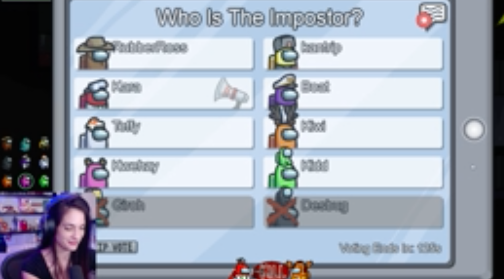
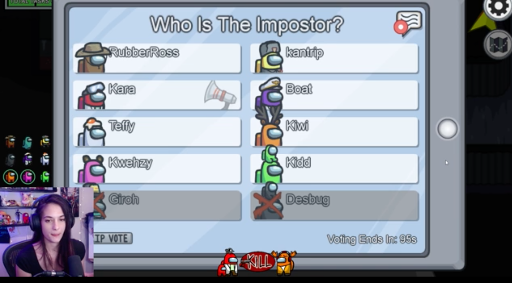

## Game Classifier

The Game Classifies a given image of as one of 
5 categories: Lobby, Gameplay, Meeting, Over and
Other.

### Case 1: Lobby

An image classified as "Lobby" is an among us
Lobby where gameplay has not begun

###Case 2: Gameplay

An image Classified as "gameplay" is an among us
game that is currently in progress

###Case 3: Meeting

An image classified as "Meeting" shows an among
us game where the players are in a meeting

###Case 4: Over

An image classified as "Over" represents the
final screen of an among us game

###Case 5: Other

Any Image that does not fall into one of the
above categories (ie. gameplay of another game)
is classified as "Other"

## Player Identifier

## Winner Identifier

## Resolution

The Resolution of the Images has a big impact on
the algorithm. The size of an image grows with 
the square of the dimensions of the image as seen in figure 1, and 
both the runtime memory consumption and disk
space that the project takes up are proportional
to the size of the images. Additionally, the
number of connections between neural network 
layers is proportional to the square of the size
of the image and thus the fourth power of the
dimension of the image.

Figure 1: Sizes of Images at different 
resolutions

Thus, It is imperative to use the smallest
image resolution possible in order both to minimize
memory footprint and maximize performance.
However, there is obviously a cost to using 
lower resolution images and that is the 
quality of the images. As the resolution
decreases, features of the image become more
blurred and difficult to discern. Figures 2 and
3 demonstrate this by putting a 160p image next
to a 360p image. It's easy to see that the 360p
image is much clearer and easier to discern
features from.

Figure 2: 160p image

Figure 3: 360p image

The question then becomes, what amount of detail
is necessary for the images to have? A good rule
of thumb about what resolution is best is 
whether a human can discern the desired features
in the image. If, for example, a human can't 
read text on an image, it's reasonable to assume
that a neural network would likewise not be able
to read that text.

This text example is exactly the metric used to
determine the resolution we chose to use. Since
the Player Identifier Neural Network gives a
text output, we ought to use a resolution that
allows us to read the relevant text in the
image. The Player Identifier network needs to
be able to read the names of the players from a
voting screen which is shown in figures 2 and 3.
It is clear to tell from observation that the
text in figure 2 is not discernible whereas that
in figure 3 is. Thus, we chose an image 
resolution of 360p for this project